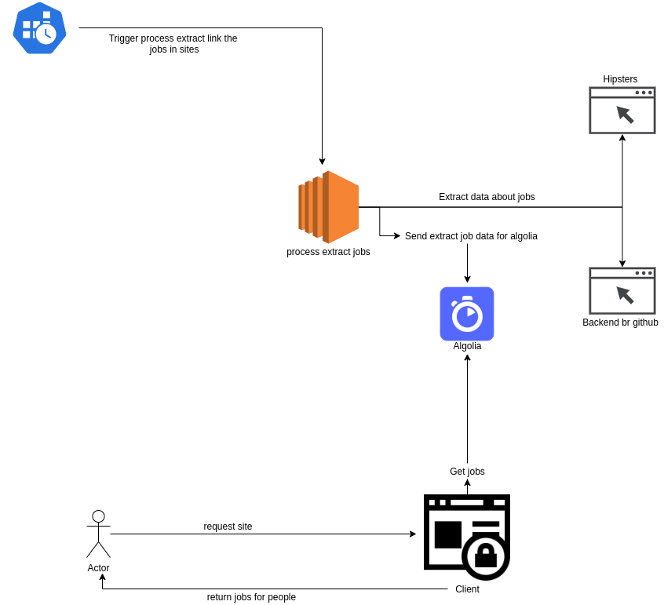

About:
=========

The project study with finally centralize jobs many sites in one place.

Technologies used in project:
- Frontend
   - Nuxt(for make SSR and resolve problem SEO)
   - Nuxt/i18n(for work internacionalization)
   - Vue
   - Algolia(Service that allow of simple form to do powerful query)

- Backend:
   - Node.js
   - Typescript
   - Algolia
   - Puppeteer(lib to scraping)
   - Winston + Sentry(Used for register the logs when cron execute web scraping for extract jobs in sites) 

Image below the project architecture:

Setting backend:
-----------------

- Clone project in github
- Execute **cd backend**
- Execute **npm install**
- Execute **npm run start:dev**

Setting frontend:
-----------------

- Clone project in github
- Execute **cd frontend**
- Execute **npm install**
- Execute **npm run dev**

